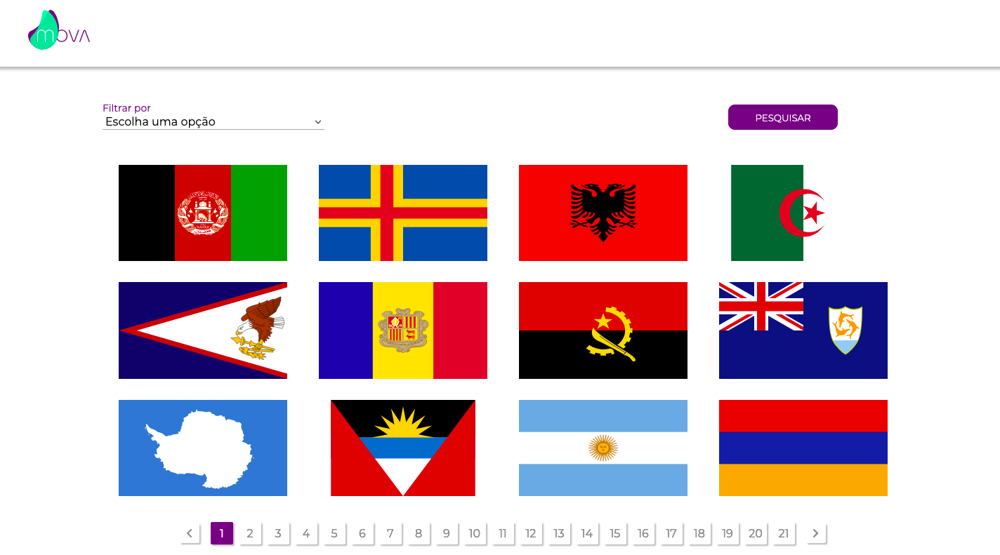
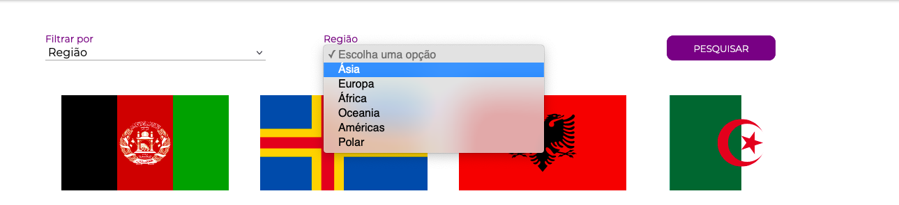
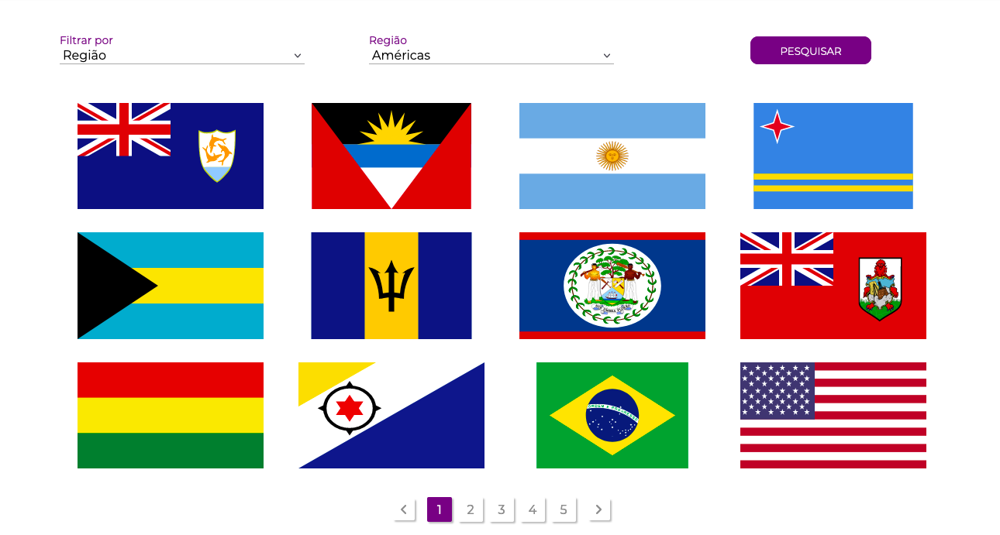
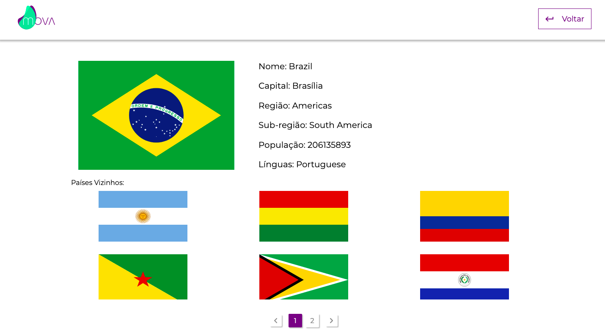

 
 
 

## About this project
This is project that, with the connection with an api that provide the data, can filter countries by region, name, capital, language and calling code. After filter the country or the countries, you can see more specic information about it and see the countries that are in his borders.

## Why
This app is part of a seletive process for the company MOVA.

## Functionalities
* First you can choose how do you want to filter the contries to get always more specif results.
* If the results are more than 12, you can see in the bottom of the page buttons to scroll between the results (this buttons are generated dynamically, according to the quantity of results).
* After get in the results you want, you can click on the flag of the contrie you want to see and receive more information about it, like his population, his capital and the languages that are spoken in it.
* You can always go back to the filters and search more, or continue to look in the results that you have obtained previously.
